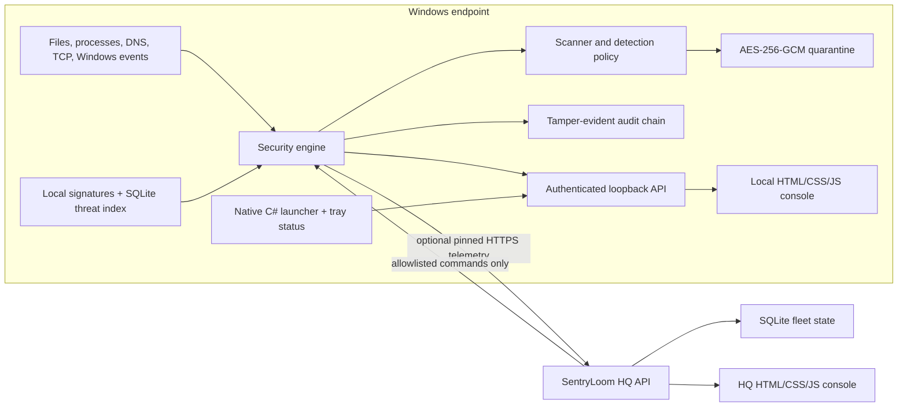
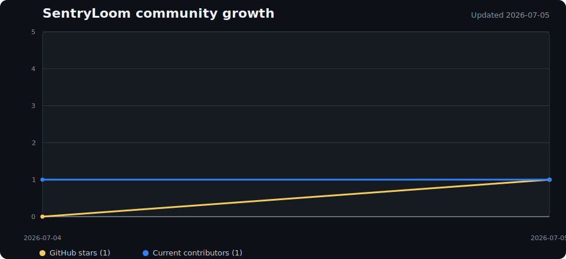

<p align="center">
  
</p>

<h1 align="center">SentryLoom</h1>

<p align="center">
  Open-source, offline-first Windows endpoint security with local antivirus
  scanning, behavioral monitoring, encrypted quarantine, community threat
  intelligence, and optional on-premises fleet management.
</p>

<p align="center">
  <a href="https://github.com/alivirgo/SentryLoom/actions/workflows/test.yml"></a>
  <a href="https://github.com/alivirgo/SentryLoom/actions/workflows/codeql.yml"></a>
  <a href="LICENSE"></a>
  
  
</p>

SentryLoom is a transparent Windows antivirus, endpoint detection and response
(EDR) learning platform, local malware scanner, ransomware monitor, and
self-hosted security operations console. It is designed for people, labs,
small businesses, schools, security researchers, and organizations that want
to understand and control where their endpoint telemetry goes.

It works fully offline for local protection. Connecting an endpoint to
SentryLoom HQ is optional, explicit, certificate-pinned, and self-hosted.

> [!IMPORTANT]
> SentryLoom is an actively developed user-mode security project, not a
> certified replacement for Microsoft Defender or a mature commercial EDR.
> Keep Defender, Windows Firewall, SmartScreen, UAC, Secure Boot, and BitLocker
> enabled. Read [SECURITY.md](SECURITY.md) before production deployment.

## Why SentryLoom

- **Local-first security:** scanning, quarantine, audit records, reputation
  lookup, and policy evaluation remain on the endpoint.
- **No mandatory cloud:** standalone endpoints do not contact SentryLoom HQ.
- **Auditable implementation:** the endpoint and server use dependency-light
  JavaScript, PowerShell, C#, HTML, and CSS instead of opaque agents.
- **Conservative response:** confirmed signatures may be quarantined;
  heuristics and behavioral signals report by default to reduce destructive
  false positives.
- **Commercial-friendly open source:** Apache License 2.0 permits personal,
  academic, internal, hosted, and commercial use, modification, and
  distribution, subject to its notice requirements.
- **On-premises fleet management:** HQ provides device approval, health
  telemetry, alerts, allowlisted response actions, and signed client updates.

## Capabilities

### Endpoint prevention and detection

- Quick, full, custom-path, startup, active-process, and removable-drive scans.
- SHA-256 exact signatures, bounded content rules, PE metadata checks, and
  conservative filename/format heuristics.
- Optional ClamAV verification with timeout and stuck-process termination.
- Recursive fixed-drive change monitoring and stabilized deep scanning of new
  Downloads.
- Process-image, parent/child, persistence, scheduled-task, service, WMI,
  ransomware-canary, write-burst, security-event, removable-media, and
  firewall-integrity monitoring.
- TCP connection metadata and Windows DNS-cache correlation with local network
  indicators. SentryLoom does not decrypt TLS or inspect packet payloads.
- Opt-in high-confidence IP blocking through Windows Defender Firewall.

### Containment, integrity, and privacy

- AES-256-GCM authenticated quarantine with exclusive temporary files and safe
  restore behavior.
- HMAC-chained, tamper-evident audit records with damaged-chain evidence
  preservation.
- Ed25519-verified offline signature bundles.
- AES-256-GCM encrypted endpoint credentials and per-device HQ credentials.
- Loopback-only local dashboard with launch tokens, HttpOnly sessions, CSRF
  protection, strict Content Security Policy, and no third-party UI assets.
- Reversible Windows DNS-over-HTTPS profiles and USB storage policy controls.

### Community threat intelligence

- ClamAV official databases.
- MalwareBazaar exact hashes.
- URLhaus payload hashes.
- Feodo Tracker botnet command-and-control indicators.
- ThreatFox hashes, domains, URLs, IPs, and IP:port indicators.
- Disk-backed SQLite indexes suitable for millions of exact indicators.

Provider credentials are entered by the operator, encrypted locally, and never
stored in source control. Each provider retains its own data license and usage
terms.

### SentryLoom HQ

- HTTPS management service with self-generated TLS and certificate pinning.
- LAN discovery and administrator-approved endpoint enrollment.
- Independent, revocable device bearer tokens.
- Two-second sanitized endpoint telemetry and 60-second offline detection.
- Fleet alerts for threats, failed collectors, failed commands, and stale
  endpoints.
- Allowlisted commands only: scans, protection repair, database updates, and
  signed client updates. There is no arbitrary remote shell API.
- Automatic recovery after Wi-Fi loss, VPN changes, sleep, hibernate, server
  outages, and process restarts.
- Signed update manifests bound to package hash, size, version, Authenticode
  certificate thumbprint, and certificate subject.

## Architecture



The complete trust-boundary and data-flow discussion is in
[docs/ARCHITECTURE.md](docs/ARCHITECTURE.md).

## How the code works

### Endpoint backend

| Area | Main files | Responsibility |
| --- | --- | --- |
| Orchestration | `src/lib/engine.js` | Starts protection, scans, monitoring, HQ management, updates, quarantine, policy, and sanitized telemetry. |
| Scanning | `scanner.js`, `clamav-engine.js`, `scan-targets.js` | Bounded traversal, hashing, rule evaluation, scan modes, ClamAV execution, progress, and cancellation. |
| Realtime protection | `protection.js` | Fixed-drive watchers, debouncing, concurrency limits, Downloads stabilization, and detection policy. |
| Behavioral monitoring | `advanced-monitoring.js`, `windows-telemetry.js` | Process, persistence, ransomware, event-log, removable-media, and firewall observations. |
| Network security | `network-monitor.js`, `firewall-policy.js` | TCP/DNS IOC correlation and opt-in Windows Firewall enforcement. |
| Threat intelligence | `threat-feeds.js`, `threat-updater.js`, `threat-index.js` | HTTPS provider clients, parsing, rate limits, transactional imports, and local reputation lookup. |
| Containment | `quarantine.js`, `key-store.js` | Authenticated encryption, metadata, restore, deletion, and local key generation. |
| Integrity | `audit-log.js`, `signature-store.js` | Chained audit records and Ed25519 signature-bundle trust. |
| HQ client | `hq-client.js`, `hq-credential-store.js` | Discovery, enrollment, TLS pinning, heartbeats, reconnect backoff, commands, and encrypted credentials. |
| Windows controls | `windows-dns.js`, `windows-usb-control.js`, `windows-notifications.js` | Scoped UAC helpers, reversible system changes, and actionable notifications. |
| Local API/CLI | `src/server.js`, `src/cli.js` | Authenticated loopback API, dashboard sessions, commands, automation, and exit codes. |

### Endpoint frontend and native shell

| Technology | Location | Responsibility |
| --- | --- | --- |
| HTML | `src/ui/index.html` | Accessible overview, scanning, quarantine, activity, policy, HQ, DNS, USB, and threat-intelligence views. |
| CSS | `src/ui/styles.css` | Responsive dark/light interface without external UI frameworks. |
| Browser JavaScript | `src/ui/app.js` | API calls, status rendering, scan controls, settings, alerts, output viewer, and reconnect UX. |
| C# / WinForms | `launcher/SentryLoomLauncher.cs` | Windowless process launch, single-instance GUI restore, system-tray health icon, and bounded background output capture. |
| PowerShell | Root `*.ps1` files | Scheduled tasks, elevation boundaries, installer registration, DNS/USB helpers, updates, and clean removal. |

### HQ backend

| File | Responsibility |
| --- | --- |
| `server/src/server.js` | HTTPS/API routing, admin sessions, CSRF, device authentication, enrollment, alerts, telemetry, commands, updates, and static UI. |
| `server/src/store.js` | SQLite schema, device/token records, telemetry history, approval queue, commands, revocation, and password hashing. |
| `server/src/update-service.js` | Signed update-manifest validation and package integrity checks. |
| `server/src/init.js` | First-run configuration, PBKDF2 password hashing, TLS metadata, and database initialization. |
| `server/src/main.js` | Configuration loading, listener startup, discovery, retention, and graceful shutdown. |

### HQ frontend

`server/public/` is a framework-free HTML/CSS/JavaScript operations console.
It renders enrollment approvals, fleet online state, active alerts, endpoint
posture, scan trends, quarantine metadata, remote commands, client releases,
and server reachability. Browser APIs communicate only with the same-origin HQ
API.

## Languages and platform components

| Language or technology | Use |
| --- | --- |
| JavaScript / Node.js 24+ | Endpoint engine, scanner, local API, CLI, HQ service, tests, metrics automation. |
| HTML5 and CSS3 | Endpoint and HQ user interfaces. |
| Browser JavaScript | Interactive dashboards with no runtime UI dependencies. |
| PowerShell | Windows administration, scheduled tasks, setup, signing, DNS, USB, updates, and lifecycle scripts. |
| C# / WinForms | Native Windows launcher, notification-area icon, and invisible background process host. |
| SQLite | Local threat intelligence and HQ fleet persistence through Node's built-in SQLite API. |
| Inno Setup | Separate endpoint and HQ Windows installers. |
| Mermaid / SVG | Architecture and community growth visualizations. |

The runtime intentionally has no npm package dependencies.

## Install and run

### Requirements

- Windows 10/11 or Windows Server 2022+.
- Node.js 24 or newer.
- PowerShell 5.1 or PowerShell 7.
- Optional: Cisco ClamAV for expanded scanning.
- Administrator access for system-wide monitoring, installation, DNS, USB,
  firewall, or HQ setup.

### Endpoint from source

```powershell
git clone https://github.com/alivirgo/SentryLoom.git
cd SentryLoom
npm test
node .\src\cli.js dashboard
```

Register windowless resident protection, a daily quick scan, and a weekly idle
full scan:

```powershell
.\Register-SentryLoom.ps1 -SystemWideProtection
```

The notification-area icon is green while HQ is reachable and red otherwise.
Double-clicking it restores the console. Background output is available under
**Activity → Resident command output**.

### HQ from source

Run in an elevated PowerShell window:

```powershell
cd .\server
.\Initialize-SentryLoomHq.ps1 `
  -PublicHost security-hq.example.local `
  -HqName "Security Operations" `
  -RegisterStartupTask
```

Setup creates the TLS certificate, SQLite database, firewall rules, and
self-restarting startup task. The packaged HQ installer asks the administrator
to choose and confirm a password; source setup generates one unless
`SENTRYLOOM_HQ_SETUP_ADMIN_PASSWORD` is supplied to the initialization process.

### CLI

```text
sentryloom dashboard [--no-open] [--port 3210]
sentryloom quick|full|startup|processes|external [--json] [--no-quarantine]
sentryloom scan <path> [--json] [--no-quarantine]
sentryloom protect [path ...]
sentryloom status [--json]
sentryloom quarantine list|restore|delete
sentryloom signatures status|trust|import
sentryloom update [all|clamav|malwarebazaar|urlhaus|feodotracker|threatfox]
sentryloom ioc lookup <ip-domain-url>
sentryloom dns status|apply|restore
sentryloom firewall status|clear
sentryloom audit verify
sentryloom hq discover|status|disconnect
```

Scan exit codes are `0` for clean, `1` for operational error, and `2` for a
detection.

## Build installers

Unsigned development packages:

```powershell
.\build\Build-Release.ps1 -AllowUnsignedDevelopmentBuild
```

Signed packages using a PFX:

```powershell
$password = Read-Host "PFX password" -AsSecureString
.\build\Build-Release.ps1 `
  -PfxPath C:\secure\code-signing.pfx `
  -PfxPassword $password `
  -ExpectedPublisher "Your Organization"
```

Private keys, PFX files, generated installers, compiled executables, databases,
runtime state, and encrypted credential stores are excluded by `.gitignore`.
Never commit signing material.

## Testing

```powershell
npm test
npm run check
```

The suite covers scanning, quarantine, signatures, audit recovery, feed
parsers, HQ enrollment/authentication, alerts, reconnect behavior, local
dashboard security, password handling, signed updates, and Windows parsers.
Tests use temporary data directories and harmless industry test markers.

## Security and responsible use

- Review [SECURITY.md](SECURITY.md) for implemented safeguards, limitations,
  hardening priorities, and private vulnerability reporting.
- Review the [privacy disclosure](PRIVACY.md) and
  [code signing policy](CODE_SIGNING_POLICY.md).
- Do not upload real malware, quarantine objects, endpoint logs, credentials,
  certificates, personal files, or customer telemetry to public issues.
- SentryLoom does not include an arbitrary remote shell and should not be
  modified into one.
- Community feed usage may be subject to provider-specific fair-use or
  commercial terms independent of the Apache 2.0 software license.

## Community growth

The chart below is updated daily by GitHub Actions from the GitHub API. It
tracks repository stars and the number of current GitHub contributors over
time without external analytics or embedded credentials.



Raw history is stored in
[`docs/community-metrics.json`](docs/community-metrics.json), and the generator
is [`tools/update-community-metrics.js`](tools/update-community-metrics.js).

## Contributing

Security engineers, Windows developers, malware researchers, defenders,
designers, technical writers, testers, students, and first-time open-source
contributors are welcome.

Start with [CONTRIBUTING.md](CONTRIBUTING.md), follow the
[Code of Conduct](CODE_OF_CONDUCT.md), and use GitHub Discussions or issues
before beginning a large architectural change. High-value contribution areas
include parser fuzzing, performance profiling, false-positive reduction,
Windows telemetry, accessibility, packaging, documentation, and safe incident
response workflows.

## License

Copyright 2026 NUC7 Studios and SentryLoom contributors.

Licensed under the [Apache License 2.0](LICENSE). You may use, modify,
distribute, host, and sell software based on SentryLoom under the license's
terms. The license includes an explicit patent grant. Product names and
trademarks are not licensed beyond customary attribution.

---

SentryLoom aims to make endpoint defense more local, understandable, and
collaborative—one carefully reviewed contribution at a time.
